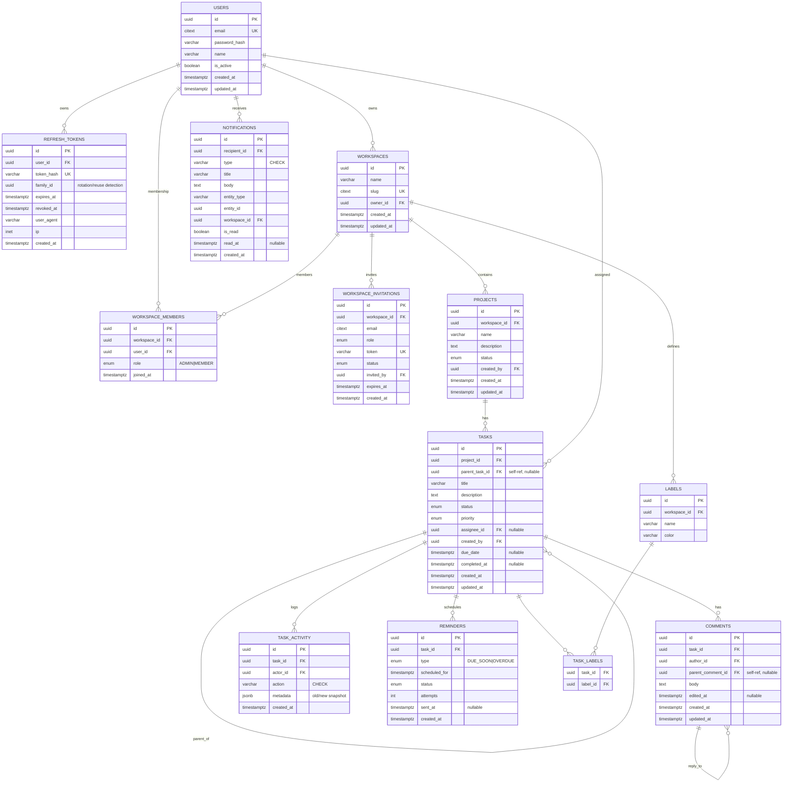

# ER Diagram + Migration Plan

> Deliverable: ER diagram / schema design + migration plan
> Status: Finalized design (pre-implementation)
> Last updated: 2026-06-05

Companion to [ARCHITECTURE.md](./ARCHITECTURE.md). Build sequence in [PLAN.md](./PLAN.md).

---

## 1. Enums (finalized value sets)

| Enum | Values | Persistence |
|---|---|---|
| `workspace_member_role` | `ADMIN`, `MEMBER` | Postgres native enum (stable set) |
| `task_priority` | `LOW`, `MEDIUM`, `HIGH`, `URGENT` | Postgres native enum |
| `task_status` | `TODO`, `IN_PROGRESS`, `BLOCKED`, `DONE`, `CANCELLED` | Postgres native enum |
| `invitation_status` | `PENDING`, `ACCEPTED`, `EXPIRED`, `REVOKED` | Postgres native enum |
| `project_status` | `ACTIVE`, `ARCHIVED` | Postgres native enum |
| `activity_action` | `CREATED`, `UPDATED`, `STATUS_CHANGED`, `ASSIGNED`, `UNASSIGNED`, `DUE_DATE_CHANGED`, `COMMENTED`, `SUBTASK_ADDED`, `COMPLETED`, `REOPENED`, `DELETED` | varchar + CHECK (likely to grow) |
| `notification_type` | `TASK_ASSIGNED`, `TASK_DUE_SOON`, `TASK_OVERDUE`, `TASK_COMPLETED`, `COMMENT_ADDED`, `COMMENT_REPLY`, `WORKSPACE_INVITE` | varchar + CHECK (likely to grow) |
| `reminder_type` | `DUE_SOON`, `OVERDUE` | Postgres native enum |
| `reminder_status` | `PENDING`, `SENT`, `FAILED` | Postgres native enum |

**Decision — hybrid enum strategy.** Stable, business-critical sets (role, status,
priority) use native Postgres enums for type safety. Sets that will grow over time
(`activity_action`, `notification_type`) use `varchar + CHECK`, because adding a value to a
native enum (`ALTER TYPE ... ADD VALUE`) cannot run inside a transaction and is not
reversible — a real migration headache. This keeps every migration atomic and
rollback-safe.

---

## 2. ER Diagram

---

## 3. Constraints & Index Catalog

| Table | Unique / Constraints | Indexes (beyond PK) | FK on-delete |
|---|---|---|---|
| `users` | `UQ(email)` (citext) | — | — |
| `refresh_tokens` | `UQ(token_hash)` | `(user_id)`, `(family_id)` | `user_id` → CASCADE |
| `workspaces` | `UQ(slug)` | `(owner_id)` | `owner_id` → RESTRICT |
| `workspace_members` | `UQ(workspace_id, user_id)` | `(user_id)` | both → CASCADE |
| `workspace_invitations` | `UQ(token)`, `UQ(workspace_id, email) WHERE status=PENDING` | `(workspace_id)` | `workspace_id` → CASCADE |
| `projects` | — | `(workspace_id)` | `workspace_id` → CASCADE |
| `tasks` | `CHECK(parent_task_id <> id)` | `(project_id)`, `(parent_task_id)`, `(assignee_id)`, `(status)`, partial `(due_date) WHERE status NOT IN (DONE,CANCELLED)` | `project_id` → CASCADE, `parent_task_id` → CASCADE, `assignee_id` → SET NULL |
| `comments` | — | `(task_id, created_at)`, `(parent_comment_id)` | `task_id` → CASCADE, `parent_comment_id` → CASCADE |
| `task_activity` | `CHECK(action IN ...)` | `(task_id, created_at DESC)` | `task_id` → CASCADE |
| `notifications` | `CHECK(type IN ...)` | `(recipient_id, is_read, created_at DESC)`, `(workspace_id)` | `recipient_id` → CASCADE |
| `reminders` | `UQ(task_id, type, scheduled_for)` (idempotency) | `(status, scheduled_for)` | `task_id` → CASCADE |
| `labels` | `UQ(workspace_id, name)` | — | `workspace_id` → CASCADE |
| `task_labels` | `PK(task_id, label_id)` | `(label_id)` | both → CASCADE |

**Index intent highlights:**
- Partial `tasks(due_date) WHERE status NOT IN (DONE,CANCELLED)` — the scheduler scans
  only open, dated tasks cheaply.
- Composite `notifications(recipient_id, is_read, created_at DESC)` — powers the unread
  inbox query directly.
- `UQ(reminders.task_id, type, scheduled_for)` — the idempotency backbone of the reminder
  pipeline.

---

## 4. Migration Plan

**Conventions (decisions):**
- TypeORM migrations, timestamp-prefixed, sequential; every migration has a working
  `up()` and `down()`.
- `synchronize: false` in all environments — schema only ever changes through migrations.
- A one-shot `migrate` container runs pending migrations and exits before `api`/`worker`
  start (healthcheck-gated).
- Never edit a merged migration — always add a new one (immutable history).
- CI runs `migration:run` then `migration:revert` against an ephemeral DB to prove
  reversibility.
- UUIDs via `gen_random_uuid()` (`pgcrypto`); case-insensitive email/slug via `citext`.

### Ordered migrations (dependency-respecting)

| # | Migration | Creates | Why this order |
|---|---|---|---|
| **M0** | `init-extensions-enums` | enable `pgcrypto`, `citext`; create all native enum types | Everything below depends on these |
| **M1** | `users-and-auth` | `users`, `refresh_tokens` + indexes | Auth foundation; no FKs out |
| **M2** | `workspaces-membership` | `workspaces`, `workspace_members`, `workspace_invitations` | Depends on `users` |
| **M3** | `projects` | `projects` | Depends on `workspaces` |
| **M4** | `tasks-and-labels` | `tasks` (self-ref + cycle CHECK), `labels`, `task_labels` | Depends on `projects`, `users` |
| **M5** | `comments` | `comments` (self-ref) | Depends on `tasks` |
| **M6** | `task-activity` | `task_activity` | Depends on `tasks` |
| **M7** | `notifications` | `notifications` | Depends on `users` |
| **M8** | `reminders` | `reminders` (idempotency UQ) | Depends on `tasks` |
| **M9** | `performance-indexes` | partial/composite indexes confirmed via `EXPLAIN ANALYZE` | After tables exist + query patterns known |

**Deferred (only if profiling demands):**
- `M10 task-closure-table` — denormalized read-path for deep subtree queries. Not built
  day one — adjacency-list + recursive CTE first.

**Seeding** (script, not a migration): a `seed` command creates a demo admin user, a
workspace, a project, and a few nested tasks — for local dev and e2e fixtures. Kept out of
migrations so prod schema and demo data never mix.

---

## 5. Nested Subtasks — Recursive Strategy

| Strategy | Read subtree | Write/move | Verdict |
|---|---|---|---|
| **Adjacency list** (`parent_task_id`) | Recursive CTE | Trivial (one column) | **Primary** — simple, normalized |
| Closure table | O(1) subtree via join | Maintenance on move | Add later if deep-tree reads dominate |
| Materialized path | Prefix `LIKE` query | Re-write paths on move | Alternative |

**Decision:** adjacency list as the model of record; read entire subtrees via
`WITH RECURSIVE` (also yields depth + roll-up counts). Guardrails: max-depth limit and
cycle prevention (`CHECK(parent_task_id <> id)` plus an application-level ancestor check).
Layer a closure table later only if subtree reads become the hot path.
